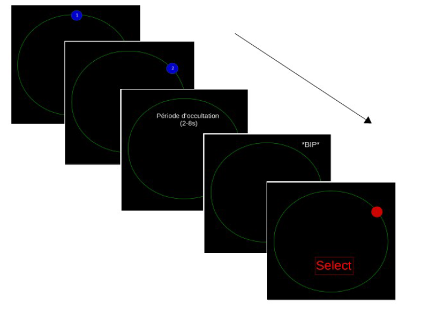

# MSc Internship

Internship under the supervision of [Robin Baures](http://cerco.ups-tlse.fr/) and [Tushar Chauhan](http://cerco.ups-tlse.fr/)

## Main objective

We are living in a dynamic environment where moving object are often temporarily occluded and its sometimes necessary to estimate the exact position of this occluded object. People can also track the current number on a hidden stopwatch. Previous work has suggested that a common rate control module paces mental updating in both physical space and number-space. We tested this by comparing single and dual task conditions using 3 differents psychophysics tasks:

- In the first one, participants had to observe a ball that rotated clockwise. At an unpredictable point the ball disappeared. Participants assumed continued occluded rotation at the same velocity, and pressed when they heard a "bip" sound. At each trial, the velocity of the ball changed.

- The second one, participant had to observe the digital counter inside the moving ball. They had to only focus on the number not the motion. At an unpredictable point, the ball disappeared. Parcipants assumed contined to count at the same "speed", and pressed when they heard a "bip" sound. At each trial, we varied the digital counter speed.

- In the last one, they had to do both tasks in the same time.

## Results

The participants performance for single and dual task were similar and it suggests that people can extrapolate through physical and number space simultaneously. This observation is in line with the real existence of a common rate control.

## Documentation

